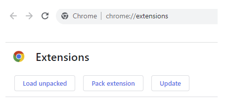
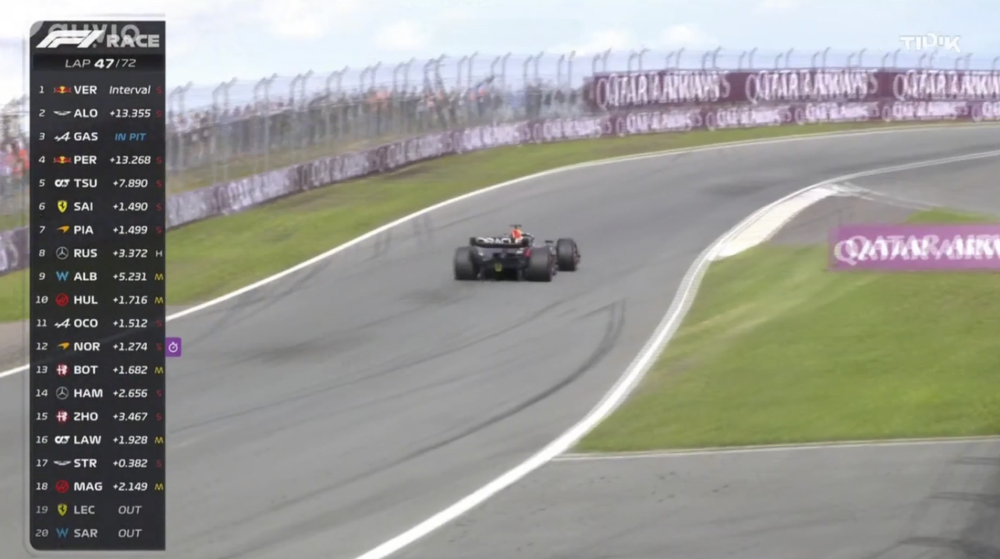
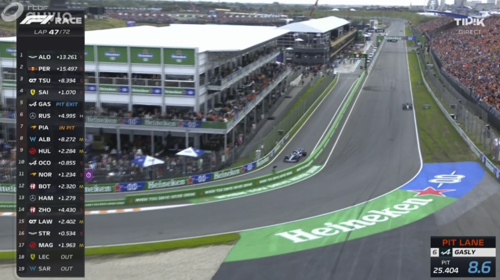

# formula1-extension

# Goal

(I'm not a Max hater; just wanted to experiment with DOM manipulation)
An extension to delete or cover Max Verstappen's name from the leaderboard graphic for AUVIO/RTBF Formula 1 live streams. When a live stream or previous race/sprint/qualifying/... video is opened, the extension adds an image on top of the live stream/video. This image shifts the positions by one. The first position is covered because of this.

# Tools

The scripts is written in JavaScript and uses a MutationObserver to manipulate the DOM.

# Usage

To use the extension in Google Chrome, you can go to your extension menu and load the folder "extension" with the option "Load Unpacked". To use the extension a refresh is needed.

# Visual

### Before

### After

### Gif

# Further improvements

The extension covers the first position and shifts the other positions by one. The cover image stays the same and does not change or disappear (for example when the leaderboard grahpic isn't visible anymore). The cover image can cover the driver in first place, even though Max Verstappen not being in first place.
